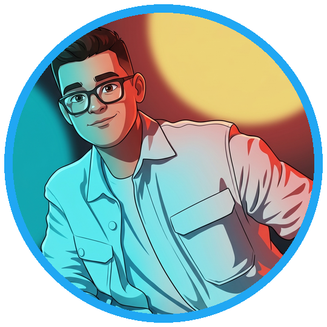

  

<h1 align="center">Игорь Борисов (Yujir0k)</h1>

  

  <strong>ML/AI-специалист, разработчик прикладных AI-решений, студент Финансового университета</strong>

  
  
  

Я занимаюсь машинным обучением, созданием AI-продуктов и активно участвую в хакатонах. Мне интересно превращать сложную постановку в работающий продукт: разобраться в домене, проверить ML-гипотезы, собрать модель, API, интерфейс и воспроизводимый запуск, а затем показать ценность решения без лишних объяснений.

Больше всего меня привлекают сложные реальные задачи, где нужно не просто применить готовый алгоритм, а разобраться в предметной области, найти нестандартный ход и собрать решение, которое можно показать пользователю. Особенно интересны направления **Computer Vision**, **NLP/Speech**, **LLM/AI-инструменты** и продуктовая разработка.

Учусь на **3 курсе Финансового университета при Правительстве РФ** по направлению **«Прикладная математика и информатика»**, профиль **«Машинное обучение»**. Большинство хакатонных проектов мы делаем вместе с нашей командой **R² negative**.

## Чем я полезен

<strong>Посмотреть подробнее</strong>

| Направление | Что умею делать |
|---|---|
| **ML / Deep Learning** | строить baseline и production-ready ML-пайплайны, работать с PyTorch, scikit-learn, Transformers, табличными данными, временными рядами и метриками качества |
| **Computer Vision** | semantic segmentation, object detection, OCR, barcode/QR recognition, preprocessing, postprocessing и проверка качества CV-решений |
| **NLP / Speech / Audio** | speech enhancement, lip reading, text/audio pipelines, LLM-based reasoning, генерация и обработка текстов |
| **AI-инструменты в инженерной работе** | эффективно использовать AI-инструменты для исследования задачи, генерации гипотез, ускорения разработки, документации и demo-flow |
| **Backend / MLOps** | FastAPI, Docker, CI/CD, Git, GitLab pipelines, мониторинг, воспроизводимые окружения и упаковка решений |
| **Продуктовая разработка** | быстро собирать рабочий прототип, понятный интерфейс, презентацию и демонстрационный сценарий под бизнес-задачу |

## Технический стек

<strong>Посмотреть подробнее</strong>

  

**AI-инструменты и workflow**

  
  
  
  
  
  
  
  

**ML / Data**

  
  
  
  
  
  
  

**CV / NLP / LLM**

  
  
  
  
  
  
  
  
  

**Backend / API / Product**

  
  
  
  

**Infra / DevOps**

  
  
  
  

**Фокусные направления**

  
  
  
  
  
  
  

## Хакатоны и результаты

В хакатонах я фокусируюсь на задачах, где важны и ML-качество, и инженерная сборка продукта: модель, интерфейс, воспроизводимый запуск, понятный demo-flow и защита решения.

Ключевые результаты: **🥇 первые места** на ReVoice25 и Lenta Tech Life Hack, **🥈 вторые места** на WILDHACK, хакатоне Роснефти и Рекламотон, **🥉 третьи места** на Первом городском хакатоне Обнинска и АтомикХак 3.0, а также несколько **🏅 четвертых мест**, финалов и специальных призов.

<strong>Посмотреть полную таблицу результатов</strong>

| Награда | Хакатон / организатор | Задача / кейс | Что сделали | Репозиторий |
|---|---|---|---|---|
| **🥇 1 место** | MTУСИ ReVoice25 | Восстановление качества искаженной речи | Pipeline для улучшения речи с фокусом на естественное звучание и экспертную MOS-оценку | [ReVoice25-R2negative-1st-place](https://github.com/Yujir0k/ReVoice25-R2negative-1st-place) |
| **🥇 1 место по предварительной оценке жюри** | Lenta Tech Life Hack | Контроль полки по видео прохода робота | CV/OCR-сервис для распознавания товаров, ценников, скидок, barcode/QR и экспорта результата в CSV | [Polka_pod_kontrolem](https://github.com/Yujir0k/Polka_pod_kontrolem) |
| **🥈 2 место** | ML-хакатон WILDHACK / RWB | Прогноз отгрузок и диспетчеризация транспорта | ML-платформа для прогнозирования, оценки надежности и поддержки решений диспетчера | [RWB_Flow](https://github.com/Yujir0k/RWB_Flow) |
| **🥈 2 место** | Студенческий хакатон Роснефти | Computer Vision, semantic segmentation | SegFormer-решение для сегментации карт месторождений на 40 классов | [Oilfield-Segmentation](https://github.com/Yujir0k/Oilfield-Segmentation) |
| **🥈 2 место** | Рекламотон 2025 | Интерактивный конструктор AI-персонажей | Web-продукт для генерации AI-персонажей, аватаров и ролевого общения | [Reklamoton-2025_Fabrica-Geroev](https://github.com/Yujir0k/Reklamoton-2025_Fabrica-Geroev) |
| **🥉 3 место** | Первый городской хакатон Обнинска | Кейс №3: AI-анализ здоровья полей по спутниковым снимкам | Платформа для мониторинга сельхозполей по Sentinel-2 с AI-агрономом | [R2-Farmer](https://github.com/Yujir0k/R2-Farmer) |
| **🥉 3 место** | АтомикХак 3.0 | ИИ-анализатор журналов событий приложений | AIOps-платформа для анализа логов, прогноза инцидентов и playbook-рекомендаций | [AtomikAIOps](https://github.com/Yujir0k/AtomikAIOps) |
| **🏅 4 место** | Хакатон T1 Москва | Self-Deploy: CI/CD без DevOps | CLI-продукт для автоматической генерации CI/CD pipeline без ручной DevOps-настройки | [AutoPipe-T1](https://github.com/Yujir0k/AutoPipe-T1) |
| **🏅 4 место** | Интенсив Росэлторга | Поиск закупочных процедур по номенклатурной матрице поставщика | B2B-сервис для hybrid matching и explainable поиска релевантных закупок | [RLT-Match-4th-place](https://github.com/Yujir0k/RLT-Match-4th-place) |
| **🏅 4 место / финалист трека** | MORE.Tech от ВТБ | Трек LC/NC: low-code приложение для планирования посещения офиса | Решение для планирования офисных посещений на базе low-code подхода | — |
| **🏆 Лучшее решение кейса** | Московский студенческий DATA-Хакатон 2025 / МГПУ | Спецприз «Фабрика данных» | Командное data-решение, отмеченное спецпризом кейса | — |
| **🎖 Финалист** | FINAM x HSE AI Trade Hack | Кейс TRADER | Решение для AI-assisted trading-задачи | — |
| **🎖 Финалист** | Best Hack | Финальный этап хакатона | Участие в финале соревнования | — |
| **📌 Участие / сертификат** | CodeGryphon Hackathon | AI-генератор маркетинговых стратегий | Zero-backend web-инструмент для генерации buyer personas, офферов и коммуникационной стратегии | [PersonaShift](https://github.com/Yujir0k/PersonaShift) |
| **📌 Участие / исследовательский кейс** | OmniSub2026 от AIRI и МТУСИ | Visual-only lip reading | Лицензионно-чистый lip-reading pipeline, построенный с нуля без аудиоканала | [OmniSub2026-lipRead-Case](https://github.com/Yujir0k/OmniSub2026-lipRead-Case) |

## Избранные фокусы

<strong>Посмотреть подробнее</strong>

- **ML, который можно показать и запустить:** не только ноутбук, но и API, UI, Docker, артефакты и понятный сценарий демонстрации.
- **AI как ускоритель разработки:** быстро использую LLM и AI-инструменты для исследования домена, генерации идей, прототипирования и проверки гипотез.
- **Сильная хакатонная упаковка:** умею превращать ограниченное время в рабочий продукт с понятной ценностью, метриками и презентацией.
- **Практический стек:** Python, PyTorch, Transformers, scikit-learn, OpenCV, FastAPI, Docker, Git, CI/CD, SQL, HTML/CSS/JS.

## Сейчас мне интересны

<strong>Посмотреть подробнее</strong>

- Computer Vision и мультимодальные решения
- NLP / Speech / lip reading
- LLM-продукты и AI-агенты
- MLOps, AIOps и production-ready ML-решения
- Финтех, ритейл, логистика и промышленная аналитика

---

<strong>Short English Summary</strong>

I am **Igor Borisov (Yujir0k)**, a 3rd-year Applied Mathematics and Computer Science student at the Financial University under the Government of the Russian Federation, specializing in Machine Learning.

I build applied ML/AI products across Computer Vision, NLP/Speech, AIOps, forecasting, CI/CD automation and LLM-assisted workflows. My focus is turning ideas into working products with models, APIs, interfaces, reproducible environments and clear demos.

Hackathon highlights include 1st place at ReVoice25, 2nd place at Rosneft Student Hackathon / Reklamoton / WILDHACK, 3rd place at AtomikHack 3.0 and the First City Hackathon of Obninsk, plus several finalist and special-prize results.

## GitHub-активность

<picture>
  <source media="(prefers-color-scheme: dark)" srcset="assets/github-contribution-grid-snake-dark.svg" />
  <source media="(prefers-color-scheme: light)" srcset="assets/github-contribution-grid-snake.svg" />
  
</picture>
